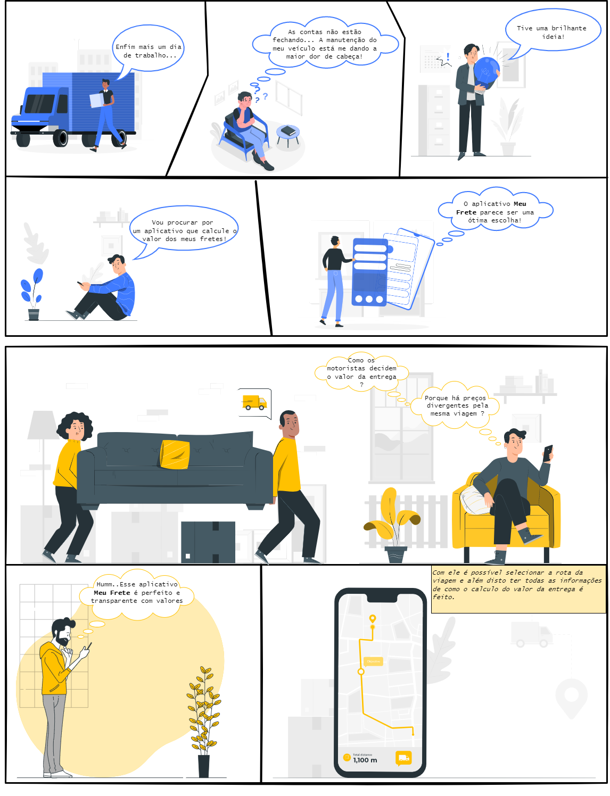
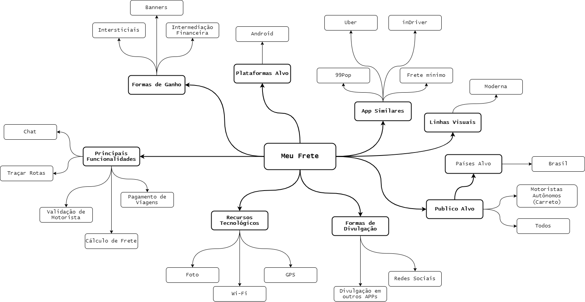
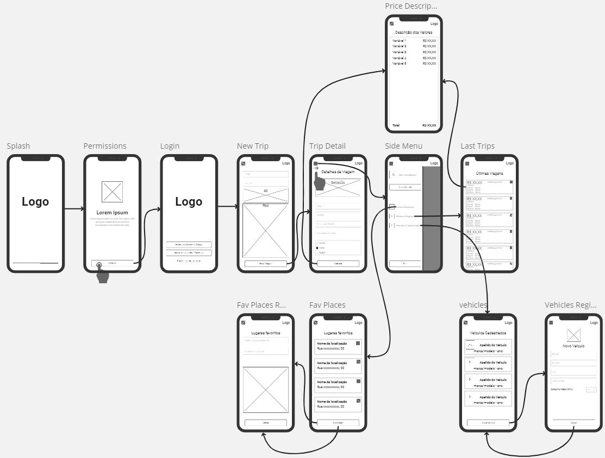
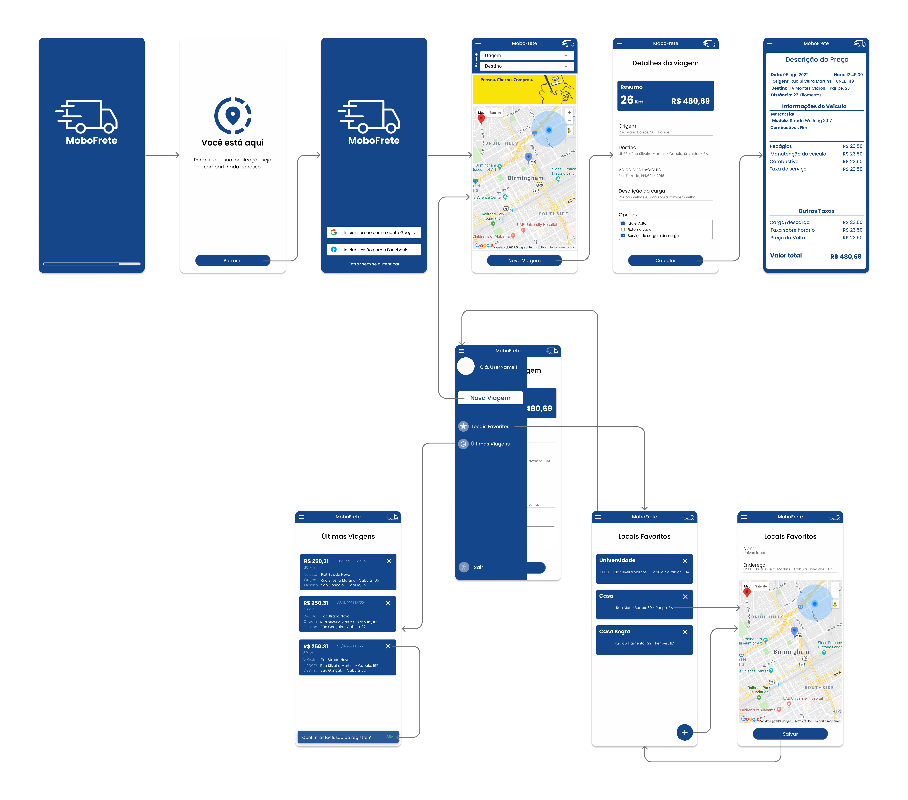
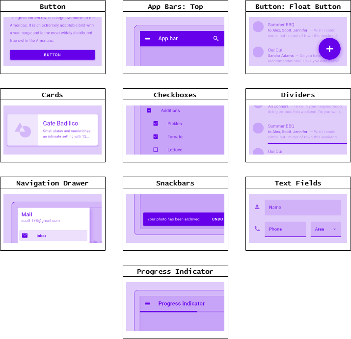

# MeuFrete App

O MeuFrete, é um aplicativo móvel que pretende auxiliar o processo de calculo de fretes, permitindo que seus usuários pré-configurem diversos parâmetros que impactam no custo do serviço.

Sua motivação principal, é tornar transparente, através da exibição detalhada dos valores que compõe o custo final do frete, para seus usuários, visando assim promover a prática de preços justos e equilibrados.

A ferramenta pode ser utilizada tanto por prestadores de serviço, quanto por solicitantes e propõe-se a ser apenas uma ferramenta de cálculo, não um intermediador de serviços.

----

## StoryBoard

Nos boards abaixo são apresentados, de forma sucinta, dois contexto de utilização do app MeuFrete.



----

## Mapa Conceitual

O mapa conceitual detalha algumas características do projeto, definindo os nichos em que o app está inserido.



## Aplicações Correlatas

Na tabela abaixo, são exibidas as aplicações correlatas e suas características em comum com as definidas na concepção do MeuFrete.

| Features / Apps Correlatos | Frete Mínimo | InDriver | Uber |
|--- |--- |--- |---
| **Nº Downloads** | 10 mil+ | 100 mi+ | 500 mi+
| **Autenticação Com Google** | SIM | SIM | SIM
| **Detalhamento do Preço** | SIM | NÃO | NÃO
| **intermediação do Pagamento**| NÃO | SIM | SIM
| **Exibição de Motoristas Disponíveis**| NÃO | SIM | NÃO
| **Seleção de veículo para viagem**| SIM | NÃO | NÃO
| **Histórico de Viagens**| NÃO | SIM | SIM
| **Gerenciamento de Locais Favoritos**| NÃO | SIM | SIM
| **Configurações da Viagem** | NÃO | NÃO | NÃO

----

## Design

### Protótipo de Baixa Fidelidade

O protótipo de baixa fidelidade foi construído nas etapas iniciais da elaboração do projeto, e exibe as premissas básicas, principais funcionalidades e fluxos de uso do sistema.



### Protótipo de Alta Fidelidade

No protótipo de alta fidelidade a estilização e linha de design definidos são melhor detalhados. As iterações com a interface podem ser visualizados em [MeuFrete-Figma](https://www.figma.com/proto/Uhwi3jtcAggMoEP2ZFMLin/MoboFreteActions?scaling=scale-down&page-id=0%3A1&starting-point-node-id=1%3A1591&node-id=1%3A1591).



### Material Design

A IU da interface foi construída utilizando alguns dos componentes do [Material](https://material.io/components?platform=android), abaixo exibimos os componentes utilizados. Para observar com mais detalhes os locais onde os componentes foram aplicados, basta ler os comentários presentes no nosso [board](https://https://www.figma.com/file/pl53ioGJMqgvpU34g4ePt9/MoboFrete?node-id=4%3A4).



----

## Requisitos da aplicação

- [X] Versionamento com Git
- [X] UI com Material Design
- [X] Persistência Leve (Preferências)
- [X] Persistência com SQLite
- [X] Comunicação com Servidor (REST API)
- [X] Internacionalização
- [X] Monitoramento com Google Analytics
- [X] Solicitação de Permissões

----

## Configuração da simulação de API REST

Neste projeto, utilizamos o json-server para simular nossa API REST. Para testar o projeto deste repositório você deve instalar e executar o json-server, seguindo os passos abaixo:

### Instalando o json-server

```console
npm install -g json-server
```

### Iniciando o servidor

```console
json-server --host <your-local-ip> <dir>\vehicles-fake-db.json
```

### Alterando a URL de acesso no projeto

Após executar o comando anterior o json-server irá retornar o endereço, que deverá se utilizado para realizar as requisições. Com isso basta setar um novo valor da constante ``API_Url`` definido na classe [Splash](https://github.com/v-manoel/meu-frete/blob/main/app/src/main/java/com/example/meufrete/Splash.java).
